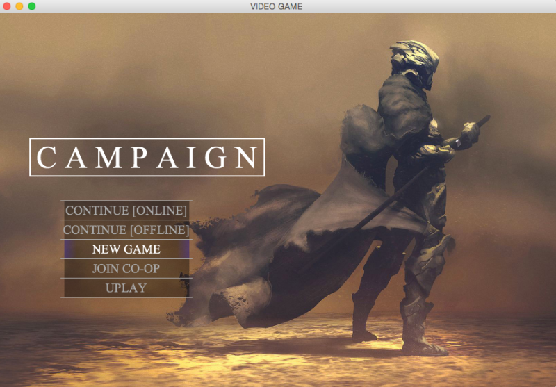
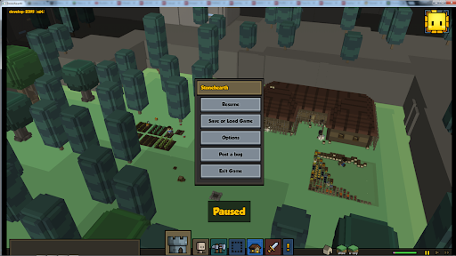
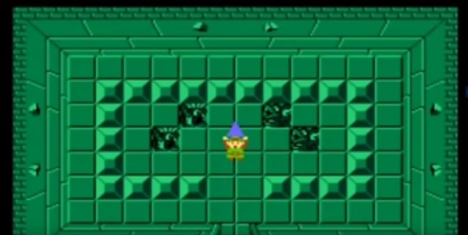
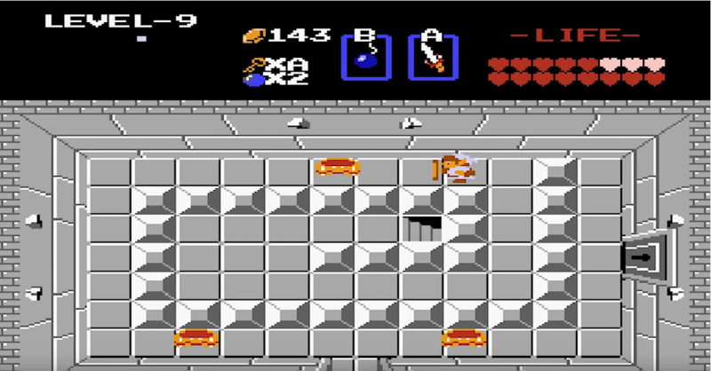
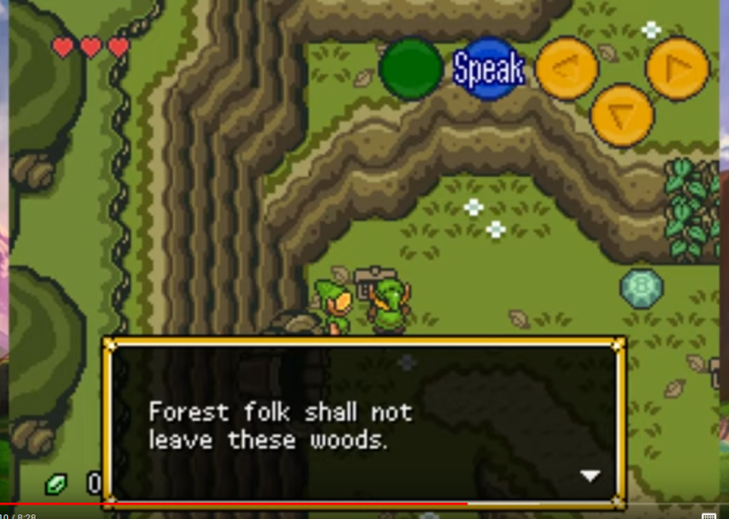

- Game Menu:  
There are two types of game menu in the game: the welcome menu and the pause menu. The welcome menu would be displayed when the user enters the game. It contains the links to the basic control of the game, such as starting a new game, exiting, and etc. The screenshot belows illustrate the fine qualities of a game menu we are looking for: an appealing picture of the actual game, game name in capital letters and buttons featuring the main control of the game. Its significance is due to as the first thing a player sees it could set the tone of the overall gaming experience. 

The game shows the pause menu when the user pauses the game play during the game. It provides the user with ways to exit the game, to save the game, or to load a new one. We believe it needs to be concise in providing the user the instruction information he needs to improve the overall gaming experience. Below is a good example that illustrates this quality.

- Game State:  
The below is an example of game state. In our design, it is composed of three layers: map (generating the walls, trees, etc), agents (playable and non-playable) and objects (interactive and non-interactive).  The map is generated regularly following a two dimensional array. The agents could move freely in the map following the user input / AI algorithms by the pre-set animation.

- Inventory Panel:  
The inventory panel shows the items that the player owns, consisting a two dimensional array-like arrangement of grids. Each grid contains the icon of an object in which the user could select and consume it.

- Game Panel:  
The game panel displays the status of the player. It includes crucial information such as score, life count, etc.

- Dialogue Panel:  
The dialogue panel is prompted when the user engages in a conversation with an NPC.

